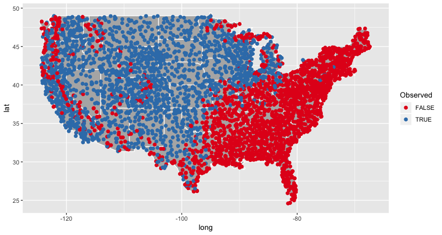

<!-- README.md is generated from README.Rmd. Please edit that file -->
[](https://travis-ci.org/oharar/rBBS)

rBBS
====

An R package to work with data from the [North American Breeding Bird Survey (BBS)](https://www.pwrc.usgs.gov/bbs/).

The BBS is a large-scale bird monitoring program that was initiated in 1966 and currently encompasses over 4,600 active survey routes in North America. Each survey involves 50 three-minute point counts conducted at half-mile intervals along a 24.5-mile route by a skilled volunteer.

The BBS is a cooperative effort between the United States Geological Survey (USGS) and Environment and Climate Change Canada's Canadian Wildlife Service (CWS). See the terms of use for BBS data [here](https://www.pwrc.usgs.gov/BBS/RawData/).

BBS datasets
------------

The BBS provides two main datasets:

*50-stop*

-   includes bird counts for each of the 50 stops on a given survey
-   only consistently available from 1997 onward

*10-stop*

-   bird counts binned into groups of 10 stops (i.e. stops 1-10, 11-20, ..., 41-50)
-   consistently available for all survey years

Installation
------------

Install the development version from GitHub with:

``` r
# install.packages("devtools")
devtools::install_github("patrickbarks/rBBS")
```

Usage
-----

#### Download data

To work with BBS data we first need to download it from the USGS ftp server. This can be done manually following the links at <https://www.pwrc.usgs.gov/bbs/>, or by using the function `bbs_download`.

``` r
# "." gives the working directory; you may prefer to specify a different one
bbs_download(dest = ".")

# or, download a specific geographic subset
bbs_download(dest = ".", states = c("Washington", "Oregon", "California"))
```

The default options download metadata files and 10-stop data. The 50-stop data can be downloaded by adding the argument `fifty_stop = TRUE`.

#### Build metadata tables

Metadata tables can be built using the `bbs_meta_*` functions.

``` r
bcr <- bbs_meta_bcr(bbs_dir = ".")
strata <- bbs_meta_strata(bbs_dir = ".")
regions <- bbs_meta_regions(bbs_dir = ".")
routes <- bbs_meta_routes(bbs_dir = ".")
weather <- bbs_meta_weather(bbs_dir = ".")
species <- bbs_meta_species(bbs_dir = ".")
```

#### Build bird count tables

Tables with bird-count data can be built using the `bbs_build_*` functions:

``` r
bbs_10 <- bbs_build_10(bbs_dir = ".") # 10-stop data
bbs_50 <- bbs_build_50(bbs_dir = ".") # 50-stop data
```

##### Build in counts of zero

The original BBS data does not include counts of zero (i.e. instances where a species was not observed on a given route), but these can be built in by setting `zeros = TRUE` in the `bbs_build_*` functions.

Note that the full dataset *with* zeros includes more than 92 million rows, which requires some time to build and a few gigabytes of memory. It's therefore a good idea to subset to the species, years, or locations of interest within the call to `bbs_build_*`, e.g.

``` r
bbs_recent <- bbs_build_10(bbs_dir = ".", zeros = TRUE, years = 2010:2015)
```

#### Joining BBS tables

Column names and types are standardized across tables to make joining easy.

``` r
# join count data with route-specific data, including geographic coordinates
bbs_recent_route <- merge(bbs_recent, routes)
```

Worked example
--------------

Let's say we're interested in the distribution of the Western Meadowlark within the contiguous United States. We can find its American Ornithological Union species code (aou) in the metadata table `species`.

``` r
species$aou[species$english_common_name == 'Western Meadowlark']
#> [1] 5011
```

We'll use the aou code to build a table with count data for the Western Meadowlark (including counts of zero), limited to the United States.

``` r
wm <- bbs_build_10(".", zeros = TRUE, countries = 'United States', aou = 5011)
```

Next, we'll subset out Alaska to keep things contiguous (sorry Alaska).

``` r
ak_num <- regions$state_num[regions$state_name == 'Alaska']
wm <- wm[wm$state_num != ak_num,]
```

Next, we'll summarize the occurrence of the Western Meadowlark by route (unique combinations of `country_num` x `state_num` x `route`). We'll calculate occurrence simply as any instance of `species_total > 0` on a given route.

``` r
wm_occur <- aggregate(
  list(occur = wm$species_total),
  list(country_num = wm$country_num, state_num = wm$state_num, route = wm$route),
  FUN = function(x) ifelse(any(x > 0), TRUE, FALSE)
)
```

Finally, we'll join the `routes` table to get geographic coordinates.

``` r
wm_occur <- merge(wm_occur, routes)
```

And then we're ready to plot!

``` r
library(ggplot2)
states <- map_data("state")

ggplot(states) + 
  geom_polygon(aes(long, lat, group = group), fill = 'grey70', col = 'white') +
  geom_point(data = wm_occur, aes(longitude, latitude, col = occur), size = 2) +
  scale_color_brewer(palette = 'Set1', name = 'Observed')
```



Contributions
-------------

All contributions are welcome. Please note that this project is released with a [Contributor Code of Conduct](CONDUCT.md). By participating in this project you agree to abide by its terms.
