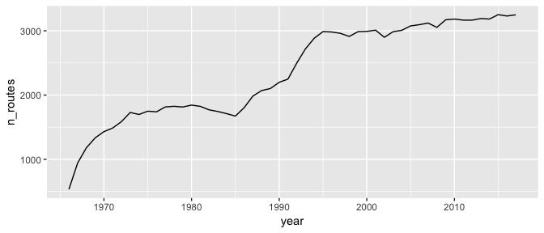
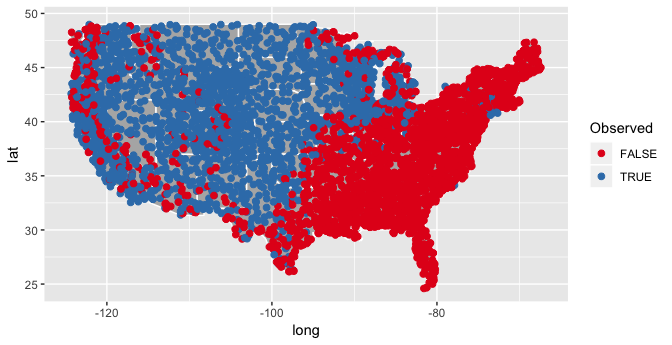
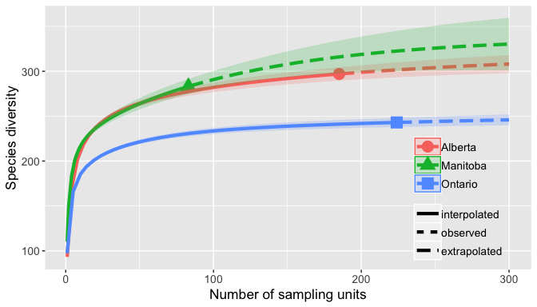
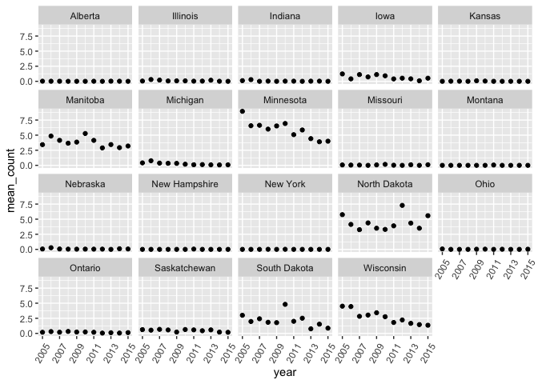

```{r setup, include = FALSE}
knitr::opts_chunk$set(
  collapse = TRUE,
  comment = "#>",
  eval = FALSE
)
# knitr::opts_knit$set(
#   root.dir = "~/bbs_data/"
# )
```

## Summary of the North American Breeding Bird Survey (BBS)

The BBS is a large-scale bird monitoring program that was initiated in 1966 and
currently encompasses over 4,600 active survey routes in North America. Each
survey involves 50 three-minute point counts conducted at half-mile intervals
along a 24.5-mile route by a skilled volunteer.

See more information at https://www.pwrc.usgs.gov/bbs/.

See the terms of use for BBS data at https://www.pwrc.usgs.gov/BBS/RawData/.

## BBS datasets

The BBS provides two main datasets:

*50-stop*

* includes bird counts for each of the 50 stops on a given survey
* only consistently available from 1997 onward

*10-stop*

* bird counts binned into groups of 10 stops (i.e. stops 1-10, 11-20, ...,
  41-50)
* consistently available for all survey years

## Installing rBBS

Install the development version from GitHub with

```{r, eval=FALSE}
# install.packages("devtools")
devtools::install_github("patrickbarks/rBBS")
```

## Load rBBS and other packages used in this vignette

```{r, message=FALSE}
library("rBBS")
library("tibble")
library("dplyr")
library("ggplot2")
```

## Downloading BBS data

The first task is to download BBS data from the USGS ftp server. This can be
done manually following the links at https://www.pwrc.usgs.gov/bbs/, or by using
the function `bbs_download`.

```{r, eval=FALSE}
# "." gives the working directory; you may prefer to specify a different one
bbs_download(dest = ".")
```

The default options download all metadata files and all 10-stop data. The
50-stop data can be downloaded by adding the argument `fifty_stop = TRUE`.

#### Download a specific subset of BBS data

Downloading all of the 10-stop or 50-stop data will take at least a few minutes,
depending on network speeds. If you only want data for select states or regions,
use the arguments `countries`, `states`, `bcr`, or `strata`, e.g.

```{r, eval=FALSE}
# download all metadata, but only download 10-stop data for the Pacific states
bbs_download(dest = ".", states = c("Washington", "Oregon", "California"))
```

## Working with metadata tables

Now that we've got the data, we can build metadata tables using the `bbs_meta_*`
functions.

```{r}
bcr <- bbs_meta_strata(bbs_dir = ".")
strata <- bbs_meta_strata(bbs_dir = ".")
regions <- bbs_meta_regions(bbs_dir = ".")
routes <- bbs_meta_routes(bbs_dir = ".")
species <- bbs_meta_species(bbs_dir = ".")
weather <- bbs_meta_weather(bbs_dir = ".")
```

#### Route metadata

Let's take a glimpse at the `routes` table.

```{r}
tibble::glimpse(routes)
#> Observations: 5,690
#> Variables: 11
#> $ country_num          <int> 840, 840, 840, 840, 840, 840, 840, 840, 8...
#> $ state_num            <int> 2, 2, 2, 2, 2, 2, 2, 2, 2, 2, 2, 2, 2, 2,...
#> $ route                <int> 1, 2, 3, 4, 5, 6, 7, 8, 9, 10, 11, 12, 13...
#> $ route_name           <chr> "ST FLORIAN", "HILLSBORO", "FLORENCE", "T...
#> $ active               <lgl> TRUE, FALSE, FALSE, TRUE, FALSE, FALSE, T...
#> $ latitude             <dbl> 34.86869, 34.63867, 34.80000, 34.02979, 3...
#> $ longitude            <dbl> -87.60414, -87.19129, -87.73333, -87.0592...
#> $ stratum              <int> 14, 14, 14, 13, 13, 14, 14, 13, 13, 11, 1...
#> $ bcr                  <int> 27, 24, 24, 28, 28, 24, 24, 28, 28, 29, 2...
#> $ route_type_id        <int> 1, 1, 1, 1, 1, 1, 1, 1, 1, 1, 1, 1, 1, 1,...
#> $ route_type_detail_id <int> 1, 1, 1, 1, 1, 1, 1, 1, 1, 1, 1, 1, 1, 1,...
```

The `routes` table gives route-specific data, primarily geographic, including
the coordinates of each survey route's starting point, and integer codes
corresponding to the country, state, physiographic stratum, and Bird
Conservation Region (bcr) that each route falls within.

Note that codes in the `route` column are only unique within states, so we need
to combine `country_num` x `state_num` x `route` to identify unique routes
survey-wide (this applies to other BBS tables as well).

Because the integer codes for the various regions don't mean much to the average
person, it is often useful to join a metadata table like `routes` with another
table that includes the full names of the regions of interest (e.g. `regions`,
`bcr`, or `strata`). For instance, we could join `routes` with the `regions`
table to attach the full names of countries and states.

```{r}
routes_regions <- left_join(routes, regions)

# notice the table now includes columns 'country_name' and 'state_name'
tibble::glimpse(routes_regions)
#> Observations: 5,690
#> Variables: 13
#> $ country_num          <int> 840, 840, 840, 840, 840, 840, 840, 840, 8...
#> $ state_num            <int> 2, 2, 2, 2, 2, 2, 2, 2, 2, 2, 2, 2, 2, 2,...
#> $ route                <int> 1, 2, 3, 4, 5, 6, 7, 8, 9, 10, 11, 12, 13...
#> $ route_name           <chr> "ST FLORIAN", "HILLSBORO", "FLORENCE", "T...
#> $ active               <lgl> TRUE, FALSE, FALSE, TRUE, FALSE, FALSE, T...
#> $ latitude             <dbl> 34.86869, 34.63867, 34.80000, 34.02979, 3...
#> $ longitude            <dbl> -87.60414, -87.19129, -87.73333, -87.0592...
#> $ stratum              <int> 14, 14, 14, 13, 13, 14, 14, 13, 13, 11, 1...
#> $ bcr                  <int> 27, 24, 24, 28, 28, 24, 24, 28, 28, 29, 2...
#> $ route_type_id        <int> 1, 1, 1, 1, 1, 1, 1, 1, 1, 1, 1, 1, 1, 1,...
#> $ route_type_detail_id <int> 1, 1, 1, 1, 1, 1, 1, 1, 1, 1, 1, 1, 1, 1,...
#> $ country_name         <chr> "United States", "United States", "United...
#> $ state_name           <chr> "Alabama", "Alabama", "Alabama", "Alabama...
```

We can now work with `routes` using familiar country or state names rather than
codes. For instance, let's find the states that have the highest number of
active survey routes.

```{r}
routes_regions %>% 
  subset(active == TRUE) %>%    # subset to currently-active routes
  group_by(state_name) %>%      # group by state
  summarize(n_routes = n()) %>% # count number of routes (i.e. rows) by state
  arrange(desc(n_routes))       # arrange states in descending order of n_routes
#> # A tibble: 62 x 2
#>    state_name       n_routes
#>    <chr>               <int>
#>  1 California            225
#>  2 Texas                 198
#>  3 Ontario               196
#>  4 Alberta               180
#>  5 Quebec                166
#>  6 British Columbia      142
#>  7 Colorado              135
#>  8 Saskatchewan          123
#>  9 Oregon                119
#> 10 New York              112
#> # ... with 52 more rows
```


#### Route-by-year metadata

The `weather` table gives environmental and other data corresponding to every
single 'run' of a route. Generally there is just one run per route per year, but
occasionally there are more — within-year replicates are indicated with an
`rpid` code different than `101`. Let's take a glimpse at `weather`.

```{r}
tibble::glimpse(weather)
#> Observations: 122,925
#> Variables: 22
#> $ route_data_id      <int> 6174482, 6178138, 6179521, 6180286, 6179841...
#> $ country_num        <int> 124, 124, 124, 124, 124, 124, 124, 124, 124...
#> $ state_num          <int> 4, 4, 4, 4, 4, 4, 4, 4, 4, 4, 4, 4, 4, 4, 4...
#> $ route              <int> 1, 1, 1, 1, 1, 1, 1, 1, 1, 1, 1, 1, 1, 1, 1...
#> $ rpid               <int> 101, 101, 101, 101, 101, 101, 101, 101, 101...
#> $ year               <int> 1972, 1973, 1974, 1975, 1976, 1978, 1979, 1...
#> $ month              <int> 6, 6, 6, 6, 6, 6, 6, 7, 6, 6, 6, 6, 6, 6, 6...
#> $ day                <int> 9, 7, 8, 2, 10, 9, 16, 12, 13, 24, 29, 27, ...
#> $ obs_n              <int> 1150175, 1150175, 1150175, 1150175, 1150175...
#> $ total_spp          <int> 47, 41, 49, 53, 49, 51, 65, 52, 66, 50, 51,...
#> $ start_temp         <int> 65, 65, 37, 56, 38, 55, 42, 50, 41, 54, 55,...
#> $ end_temp           <int> 60, 67, 58, 56, 63, 62, 55, 57, 45, 77, 65,...
#> $ temp_scale         <chr> "F", "F", "F", "F", "F", "F", "F", "F", "F"...
#> $ start_wind         <int> 1, 5, 0, 3, 1, 2, 1, 3, 3, 2, 1, 3, 2, 0, 3...
#> $ end_wind           <int> 3, 5, 1, 3, 1, 1, 3, 4, 4, 3, 1, 1, 5, 4, 4...
#> $ start_sky          <int> 1, 1, 4, 1, 0, 2, 0, 1, 2, 1, 0, 0, 8, 0, 2...
#> $ end_sky            <int> 2, 1, 1, 1, 1, 2, 1, 1, 2, 0, 0, 0, 1, 1, 2...
#> $ start_time         <chr> "0450", "0444", "0448", "0451", "0444", "04...
#> $ end_time           <chr> "0900", "0915", "0921", "0923", "0920", "09...
#> $ assistant          <lgl> FALSE, FALSE, FALSE, FALSE, FALSE, FALSE, F...
#> $ quality_current_id <lgl> TRUE, FALSE, TRUE, TRUE, TRUE, TRUE, TRUE, ...
#> $ run_type           <int> 1, 0, 1, 1, 1, 1, 1, 0, 1, 1, 1, 1, 1, 1, 0...
```

Note that the final column, `run_type`, indicates whether a given run did (`1`)
or did not (`0`) meet BBS quality standards based on weather, date, time to
completion, and other factors. The bird count tables **do** include runs that
don't meet the quality standard — we'll come back to this later.

For now, let's use the `weather` table to examine how the number of survey
routes has changed over time.

```{r, fig.width=7}
df_routes <- weather %>% 
  mutate(route_unique = bbs_route_unique(.)) %>%  # id unique routes
  group_by(year) %>%  # group by year
  summarize(n_routes = length(unique(route_unique)))  # count unique routes

ggplot(df_routes) +
  geom_line(aes(year, n_routes))
```



## Working with bird count data

Tables with bird-count data are built using the `bbs_build_*` functions
(`bbs_build_10` for the 10-stop data and `bbs_build_50` for the 50-stop data).

```{r}
# build 10-stop data for Canadian routes
bbs_cdn <- bbs_build_10(bbs_dir = ".", countries = "Canada")
```

We'll stick to the 10-stop data for the remainder of this vignette, but working
with the 50-stop data is generally the same (there are just more columns with
bird counts).

Let's take a glimpse at the `bbs_cdn` table.

```{r}
tibble::glimpse(bbs_cdn)
#> Observations: 1,003,674
#> Variables: 14
#> $ route_data_id <int> 6174482, 6174482, 6174482, 6174482, 6174482, 617...
#> $ country_num   <int> 124, 124, 124, 124, 124, 124, 124, 124, 124, 124...
#> $ state_num     <int> 4, 4, 4, 4, 4, 4, 4, 4, 4, 4, 4, 4, 4, 4, 4, 4, ...
#> $ route         <int> 1, 1, 1, 1, 1, 1, 1, 1, 1, 1, 1, 1, 1, 1, 1, 1, ...
#> $ rpid          <int> 101, 101, 101, 101, 101, 101, 101, 101, 101, 101...
#> $ year          <int> 1972, 1972, 1972, 1972, 1972, 1972, 1972, 1972, ...
#> $ aou           <int> 30, 40, 540, 700, 1320, 1370, 1400, 1420, 1430, ...
#> $ count_10      <int> 0, 0, 5, 0, 8, 3, 1, 2, 1, 0, 0, 0, 0, 0, 0, 2, ...
#> $ count_20      <int> 0, 0, 16, 2, 3, 0, 2, 1, 0, 0, 0, 1, 0, 0, 0, 1,...
#> $ count_30      <int> 0, 0, 1, 0, 0, 0, 0, 0, 0, 0, 0, 0, 0, 0, 1, 1, ...
#> $ count_40      <int> 2, 0, 5, 0, 32, 0, 2, 8, 15, 1, 0, 0, 1, 5, 1, 1...
#> $ count_50      <int> 0, 1, 3, 0, 5, 2, 2, 3, 0, 0, 1, 0, 0, 0, 0, 1, ...
#> $ stop_total    <int> 1, 1, 14, 1, 11, 3, 4, 7, 3, 1, 1, 1, 1, 1, 2, 6...
#> $ species_total <int> 2, 1, 30, 2, 48, 5, 7, 14, 16, 1, 1, 1, 1, 5, 2,...
```

We'll ignore the first column for a moment. Columns 2-7 give the metadata needed
to make sense of the bird count columns: `country_num`, `state_num`, `route`
(only unique within states), `rpid` (indicates whether the run is a standard BBS
survey or a within-year replicate), `year`, and `aou` (i.e. species).

Each row in the table corresponds to a unique combination of these 6 columns, as
do the codes in the first column `route_data_id`.

Next we have the `count_*` columns, which give bird counts for the given species
(binned into groups of 10-stops; 1-10, 11-20, ..., 41-50). Then, `stop_total`
gives the number of stops out of 50 on which the species was observed, and
`species_total` gives the total number of individuals of the species recorded on
that run (i.e. summed across all stops).

For the remainder of this vignette, we'll use bird count tables to look at three
things:

- species distribution
- species richness
- species abundance

## Species distribution

Let's say we're interested in the distribution of the Western Meadowlark within
the contiguous United States. We can find its American Ornithological Union
species code (aou) in the metadata table `species`.

```{r}
species$aou[species$english_common_name == "Western Meadowlark"]
#> [1] 5011
```

We'll use the aou to build a table with 10-stop count data just for the Western
Meadowlark in the United States (including counts of zero this time).

```{r}
wm <- bbs_build_10(bbs_dir = ".", zeros = TRUE,
                   countries = "United States", aou = 5011)
```

There are different ways we could go about creating a distribution map. Let's
say we want to plot all the routes in the contiguous United States, and colour
routes differently depending on whether the Western Meadowlark has or has not
been observed there. Here's one way.

```{r}
wm_occur <- wm %>% 
  left_join(regions) %>%  # join regions table to get state names
  subset(state_name != "Alaska") %>%  # remove alaska
  group_by(country_num, state_num, route) %>%  # group by unique routes
  summarize(occur = ifelse(any(species_total > 0), TRUE, FALSE)) %>%
  ungroup() %>%  # ungroup
  left_join(routes)  # join routes table to get route coordinates
```

And finally, we'll plot the occurrence data on a map of the United States.

```{r, fig.width=7, fig.height=3.6}
states <- map_data("state") # get map of contiguous United States

ggplot(states) + 
  geom_polygon(aes(long, lat, group = group), fill = "grey70", col = "white") +
  geom_point(data = wm_occur, aes(longitude, latitude, col = occur), size = 2) +
  scale_color_brewer(palette = "Set1", name = "Observed")
```



## Species richness

Let's compare bird species richness among Canadian provinces using the `bbs_cdn`
table that we created above.

First, we'll subset our table to only the survey runs that met the BBS quality
criteria (`run_type == 1`), so that we know we're comparing apples to apples.

```{r}
bbs_cdn_r1 <- bbs_cdn %>% 
  left_join(weather) %>%     # join weather table (run_type lives here)
  subset(run_type == 1) %>%  # subset to run_type == 1
  mutate(route_unique = bbs_route_unique(.)) # id unique routes
```

Next, we'll create a table with the total number of unique species and routes,
by province.

```{r}
df_summary <- bbs_cdn_r1 %>% 
  left_join(regions) %>%  # join to regions to get state/province names
  group_by(state_name, state_num) %>%  # group by state
  summarize(n_routes = length(unique(route_unique)), # summarize
            n_species = length(unique(aou))) %>% 
  ungroup() %>%  # ungroup
  arrange(desc(n_species))  # arrange in descending order of n_species

df_summary
#> # A tibble: 13 x 4
#>    state_name            state_num n_routes n_species
#>    <chr>                     <int>    <int>     <int>
#>  1 British Columbia             11      165       317
#>  2 Alberta                       4      185       297
#>  3 Manitoba                     45       83       283
#>  4 Saskatchewan                 79      113       249
#>  5 Ontario                      68      224       243
#>  6 Quebec                       76      191       237
#>  7 Northwest Territories        43       19       189
#>  8 New Brunswick                56       45       183
#>  9 Nova Scotia                  65       37       183
#> 10 Yukon                        93       49       168
#> 11 Newfoundland                 57       45       165
#> 12 Prince Edward Island         75        4       136
#> 13 Nunavut                      62        1        48
```

The Western provinces seem to have the highest species richness, but there seems
to be a correlation between the number of observed species and the number of
survey routes, which varies widely among provinces.

To control for this variation, we'll examine species accumulation curves using
the R package [`iNEXT`](https://github.com/JohnsonHsieh/iNEXT).

```{r}
library("iNEXT")
```

`iNEXT` can work with a few different data formats. We'll use the 'incidence
frequency' format here. For each province we need a vector of length
`n_species + 1`. The first element should be the total number of routes in that
province (`n_routes`), and the remaining elements should be counts of the number
of routes on which a given species has been detected (i.e. species-specific
route incidence frequencies).

We'll then need to arrange these vectors into a list that can be passed to
`iNEXT`.

```{r}
# species-specific route incidence, by state/province
df_freq <- bbs_cdn_r1 %>% 
  group_by(state_num, aou) %>%  # group by state and species
  summarize(n = length(unique(route_unique))) %>%  # count unique routes
  ungroup()

# arrange into list format for iNEXT, by state/province
freq_l <- list()

for (i in 1:nrow(df_summary)) {  # for each state/province...
  
  state_num_focal <- df_summary$state_num[i]   # focal state code
  state_name_focal <- df_summary$state_name[i] # focal state name
  n_routes_focal <- df_summary$n_routes[i]     # n_routes for focal state
  
  # vector of species-specific route incidence frequencies
  aou_freq <- df_freq$n[df_freq$state_num == state_num_focal]
  
  # concatenate n_routes and route incidence frequencies, and assign to 
  #  state-specific list element
  freq_l[[state_name_focal]] <- c(n_routes_focal, aou_freq)
}

```

Let's take a look at the first 15 entries of the first three list elements.

```{r}
lapply(freq_l[1:3], function(x) x[1:15])
#> $`British Columbia`
#>  [1] 165   7  10  37  11  13  43 111   1   1   7   3  18   6   1
#> 
#> $Alberta
#>  [1] 185  12   1   3  69  75  69  90  80   1  13  82  62 127   1
#> 
#> $Manitoba
#>  [1] 83  5 24 19 19 54 48  1  1  1 33  2  2 71 50
```

Looks good.

Next, let's use `iNEXT` to examine species accumulation curves for a few select
provinces.

```{r, fig.width=7, fig.height=4}
provs_inext <- iNEXT(freq_l[c("Alberta", "Manitoba", "Ontario")],
                     datatype = "incidence_freq", knot = 100, endpoint = 300)

ggiNEXT(provs_inext) +
  theme(text = element_text(size = 13),
        legend.key.width = unit(0.9, "cm"),
        legend.spacing.y = unit(0, "cm"),
        legend.position = c(0.85, 0.27),
        legend.background = element_blank())
```



Notice, even though Alberta has a higher observed species richness than
Manitoba, as we saw in the `df_summary` table, Manitoba actually has a slightly
higher predicted asymptotic species richness (i.e. assuming an infinite number
of survey routes). Manitoba just hasn't been sampled as much.

## Species abundance

Say we want to examine changes in the abundance of the Sedge Wren over the last
decade. We'll start by finding its aou code using the `species` table, and then
building a 10-stop table with Sedge Wren counts (including zeros).

```{r}
species$aou[species$english_common_name == "Sedge Wren"]
#> [1] 7240

bbs_sw <- bbs_build_10(".", aou = 7240, zeros = TRUE, years = 2005:2015)
```

Next we'll join the `weather` table and subset to only those runs that met the
BBS quality standard (`run_type == 1`).

```{r}
bbs_sw_r1 <- bbs_sw %>% 
  left_join(weather) %>% 
  subset(run_type == 1)
```

Next, we'll calculate the mean `species_total` by year and state, first joining
the `regions` table so that we can work with state names rather than codes.

```{r}
state_year_means <- bbs_sw_r1 %>% 
  left_join(regions) %>% 
  group_by(year, state_name, state_num) %>% 
  summarize(mean_count = mean(species_total)) %>% 
  ungroup()
```

Now we'll plot the data, first excluding states in which the Sedge Wren was
never observed.

```{r, fig.width=7, fig.height=5}
# codes for states where the sedge wren has been observed
state_num_obs <- unique(bbs_sw$state_num[bbs_sw$species_total > 0])

# subset state_year_means to states where observed
state_year_means_obs <- state_year_means %>% 
  subset(state_num %in% state_num_obs)

# plot
ggplot(state_year_means_obs, aes(year, mean_count)) +
  geom_point() +
  facet_wrap(~ state_name) +
  scale_x_continuous(breaks = seq(2005, 2015, 2)) +
  theme(axis.text.x = element_text(angle = 60, vjust = 0.5))
```



The plot above gives us a quick picture of how Sedge Wren abundance varies from
region to region, and how abundance has changed over the last decade. But to
formally model population abundance and trends we need more nuance.

Formal BBS analyses by researchers at the USGS are done using Bayesian
hierarchical models that control for:

- variation among obsevers,
- novice-observer effects,
- spatial effects at the level of physiographic strata,
- year-within-strata effects,
- overdispered counts, and
- variation in the size of the modelled regions

See [Sauer et al. 2013](http://fwspubs.org/doi/abs/10.3996/nafa.79.0001) for
more information.

Here we'll keep things a bit more simple. Our goal will be to fit a generalized
linear mixed model of the form:

```{r}
glmer(species_total ~ novice_observer + year +
        (year | state) +
        (1 | observer) +
        (1 | overdispersion),
      family = poisson(link = "log"))
```

We'll start by using the `weather` table to create a `novice_observer` variable,
which has a value of `TRUE` for an observer's very first year of participation,
or `FALSE` otherwise.

```{r}
obs_df <- weather %>% 
  group_by(obs_n) %>% 
  mutate(novice_observer = ifelse(year == min(year), TRUE, FALSE)) %>% 
  ungroup() %>% 
  select(route_data_id, obs_n, novice_observer)
```

Next we'll subset our Sedge Wren counts table `bbs_sw_r1` to only those states
that have at least a few nonzero counts. To help ensure model convergence,
we'll arbitrarily set a threshold of 5 or more surveys with nonzero counts for
a state to be included.

```{r}
bbs_sw_r1_sub <- bbs_sw_r1 %>% 
  group_by(state_num) %>% 
  mutate(n_survey_pos = length(route_data_id[species_total > 0])) %>%
  ungroup() %>% 
  filter(n_survey_pos >= 5)
```

Finally, we'll center `year` to have a mean of zero (helps with model
convergence), add a column for the overdispersion effect (one way to model
overdisperion with a Poisson distribution is to use a random effect with a
unique element for every observation), join observer data from `obs_df`, and
join the `regions` table so that we can use state names rather than codes.

```{r}
bbs_sw_mod <- bbs_sw_r1_sub %>% 
  mutate(overdisp = 1:n()) %>% 
  mutate(year_center = year - mean(year)) %>% 
  left_join(obs_df) %>% 
  left_join(regions)
```

Whew. We're finally ready to fit our model! We'll use the `lme4` library.

```{r}
library(lme4)

mod <- glmer(species_total ~ novice_observer + year_center +
               (year_center | state_name) +
               (1 | obs_n) +
               (1 | overdisp),
             family = poisson(link = "log"),
             data = bbs_sw_mod)

summary(mod)$coefficients
#>                       Estimate Std. Error   z value     Pr(>|z|)
#> (Intercept)         -3.4762638 0.54577464 -6.369412 1.897538e-10
#> novice_observerTRUE -0.1620199 0.11392609 -1.422149 1.549830e-01
#> year_center         -0.1172581 0.02084107 -5.626302 1.841144e-08
```

Based on the summary table, we can see that the `year_center` term was
significantly negative, indicating overall declines in counts of the Sedge Wren
over the last decade.

We can convert this slope to a geometric rate of population change using:

```{r}
grand_slope <- fixef(mod)[3]
100 * (exp(grand_slope) - 1)
#> year_center 
#>   -11.06444
```

This suggests that on average, Sedge Wren populations have declined by 11% per
year over the period 2005-2015. For reference, the official BBS analyses suggest
a figure of 3.4% decline per year.

See the official 2015 results at https://www.mbr-pwrc.usgs.gov/bbs/specl15.html

Finally, let's examine geometric population trends by state.

```{r}
ranef(mod)$state_name %>% 
  rownames_to_column("state_name") %>% 
  mutate(trend = 100 * (exp(grand_slope + year_center) - 1))
#>      state_name (Intercept)  year_center      trend
#> 1       Alberta -1.89907417 -0.001235859 -11.174283
#> 2      Illinois -0.07670816 -0.034836241 -14.109277
#> 3       Indiana -0.91567343 -0.042409551 -14.757297
#> 4          Iowa  1.45247388  0.002255639 -10.863607
#> 5        Kansas -1.42679484 -0.018105386 -12.660163
#> 6      Manitoba  3.96962660  0.078868430  -3.766214
#> 7      Michigan  1.03013114 -0.048430128 -15.268965
#> 8     Minnesota  4.21759571  0.018748515  -9.381301
#> 9      Missouri -0.42307079  0.011008707 -10.079965
#> 10     Nebraska  0.36982900  0.003170900 -10.781986
#> 11 North Dakota  3.53086035  0.134900582   1.779901
#> 12         Ohio -1.36189295 -0.005317240 -11.536076
#> 13      Ontario  0.09742448  0.031300899  -8.236651
#> 14 Saskatchewan  0.91129424  0.035861412  -7.817208
#> 15 South Dakota  1.92729080  0.052680258  -6.253688
#> 16    Wisconsin  3.15937854 -0.034480423 -14.078710
```

